# 10 Refactorings to Boost your Clean Code Efficiency

Like many things in life, even the most complicated thing is composed of a handful of simple things. For example, a beautiful design contains not more than five elements: colour, shape, size, and position. 

Coding aside, I love boxing. Although boxing is somewhat complicated, basic techniques are limited: jab, cross, hook and uppercut. For footwork, move forward, backward, left and right. If you count quarter turn as well, there are only six basic steps. And you know what? Even the greatest fighters like Floyd Mayweather or Canelo Álvarez, apart from the genius and hard work, they all masters of these simple six footwork and four punches.

## The most common 10 refactorings

Like in other fields, the 20/80 rule applies in refactoring as well. Just in case you're wondering, `20% * 48 = 9.6` is roughly 10, which we'll cover in this tutorial.


## Code smells

There are quite a few code smells in the implementation, although they are relatively trivial, and you may skip them in only a few lines of code cases. But note that the purpose is to demonstrate these code smells' names and how to identify them in your code.

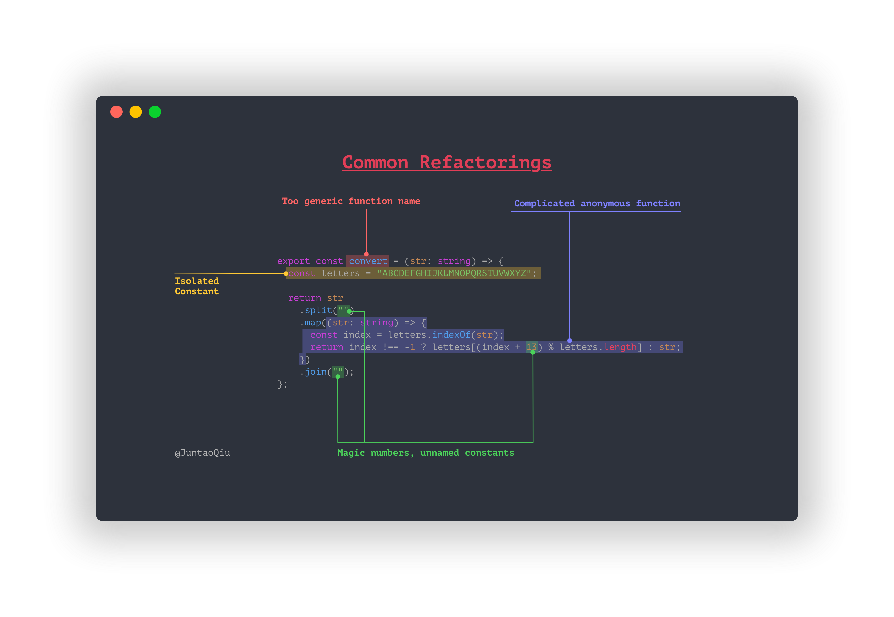


## Common Refactorings

Correspondingly, there are refactorings to fix these code smells and turns the code easier to understand and thus to be modified. If you don't have to touch the code again to add new features or fix defects in it, keeping it as is a better idea.

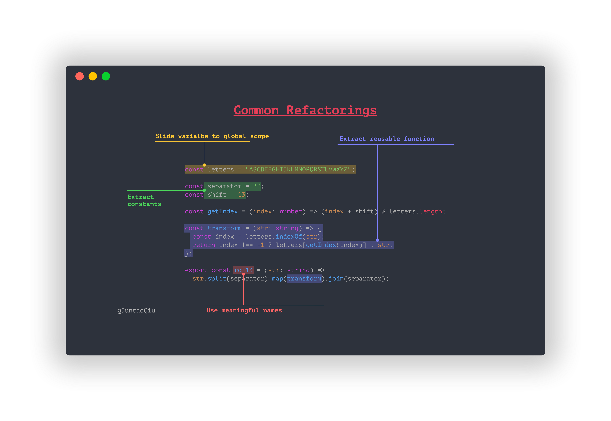

Note that the purpose of this tutorial is not implementing the function of the feature `rot13`. But mainly to focus on how we can use IDE shortcuts to help us do these common refactorings effectively. Once you have learnt the shortcuts and know when to use them, I guarantee you that your productivity will increase ten times.

We all know that coding is not about typing but thinking. But you can only have a clear version if the code is in good shape - you need a lot of unnecessary mind power to understand what's going on. So these shortcuts are not aimed to increase your typing speed, but rather, the speed of reforming and reshaping the code into a state that you (or other readers) can quickly understand and navigate.

## The Problem - ROT13

ROT13, or "rotate by 13 places", is a simple letter substitution cipher that replaces a letter with the 13th letter after it in the alphabet. So `A` becomes `N`, `B` to `O` and so on till `M` to `Z`. And then it looks backward, so `N` becomes `A` and `O` becomes `B` and so on.

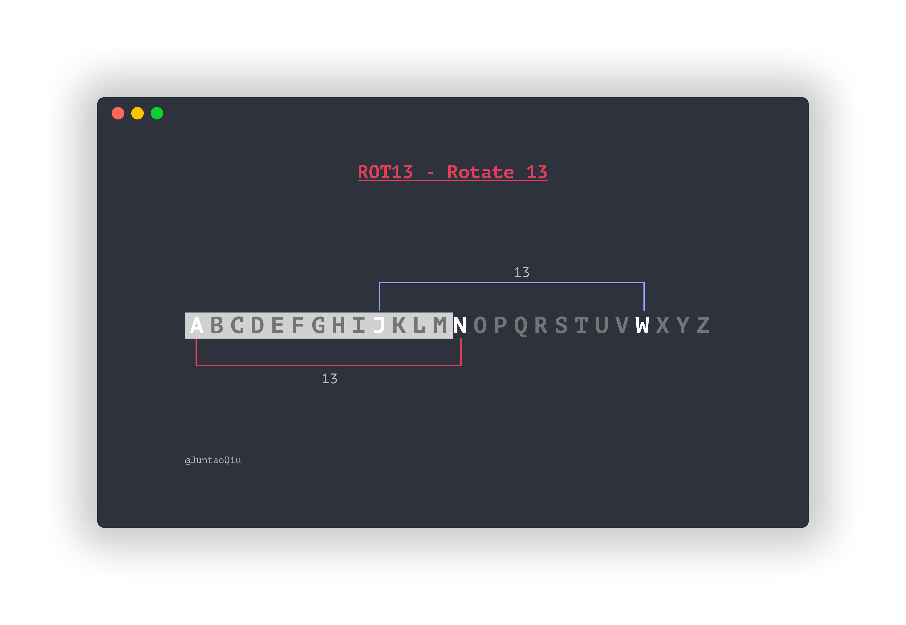

So `HELLO` becomes `URYYB` after rotation.

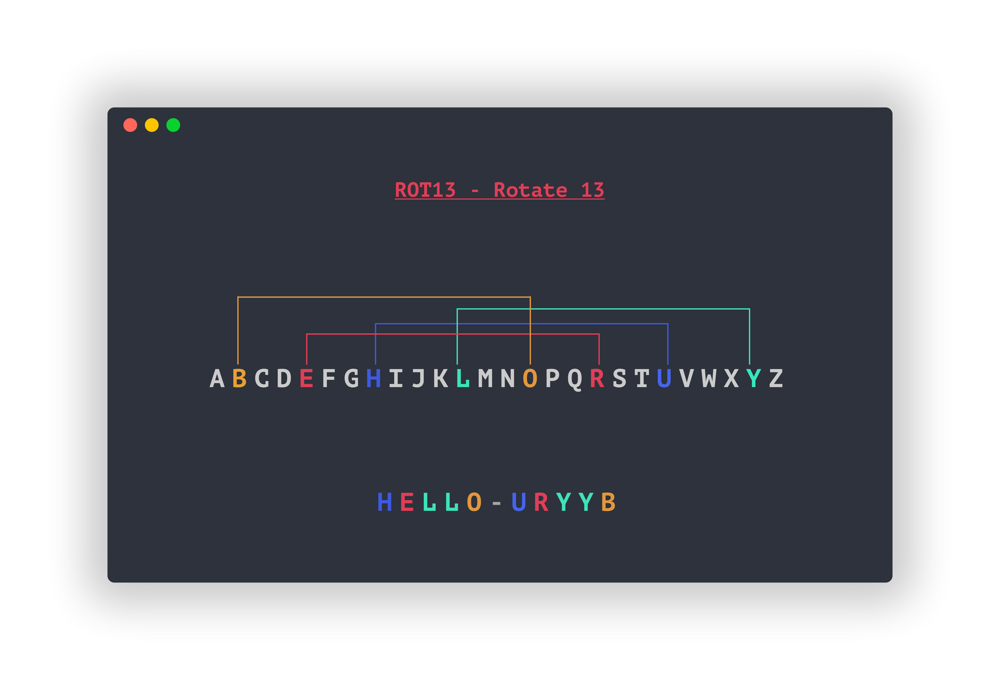

In this tutorial, we'll focus on the implementation of `ROT13` and try to apply different refactorings (with WebStorm shortcuts for demonstration).

## The implementation

So we have already got an implementation here, it could be better, but it works and can make all the tests pass.

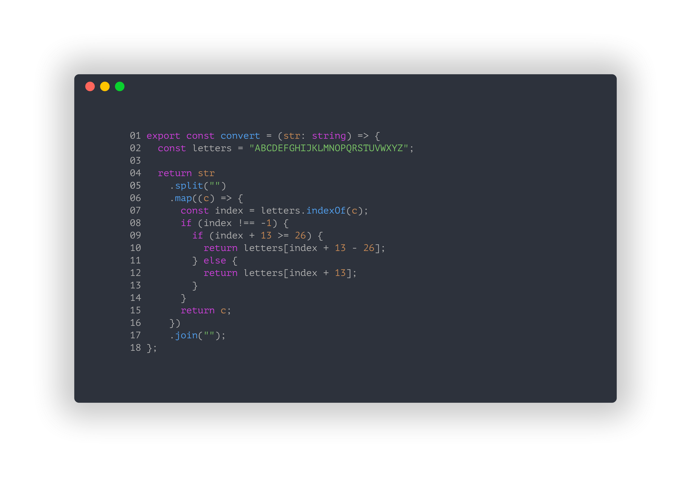

Where the corresponding tests are:

- returns N when given A
- returns A when given N
- returns NO when given AB (multiple letters)
- returns AB!! when given NO!! (keep other symbols as is while converting)

Before we make any code changes, let's run these tests first.

```ts
describe("ROT13", () => {
  it("returns N when given A", () => {
    expect(convert("A")).toEqual("N");
  });

  it("return A when given N", () => {
    expect(convert("N")).toEqual("A");
  });

  it("return NO when given AB", () => {
    expect(convert("AB")).toEqual("NO");
  });

  it("return AB!! when given NO!!", () => {
    expect(convert("NO!!")).toEqual("AB!!");
  });
});
```

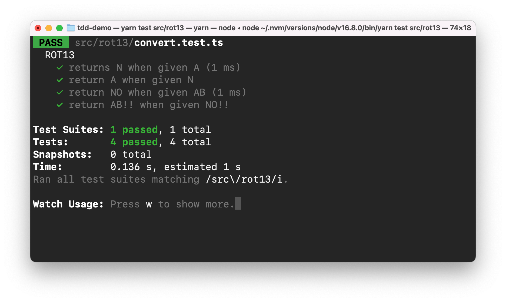


And in the following sections, we'll walk through the above implementation and try to apply some most used refactorings with WebStorm shortcuts to convert the code to a maintainable state.


### Slide Statements

Perhaps the simplest refactoring you could find, but sometimes it makes a huge difference. If you imagine source code in a file like arranging things on your desk or ordering books on your bookshelf. 

Just thinking that *Philosopher's Stone* is between *UNIX Network Programming* and *TCP/IP Guide* on your shelf, what would you do? Yes, slide the *Philosopher's Stone* into its own section. We see that in the code all the time as well, so Slide Statements is a great technique that can make the code read more smoothly and more coherent.

Just slide the code up and down by pressing `command + shift + up/down` in WebStorm. You can select multiple lines, a block (a `for` for example) or even a function and then slide them up and down. 

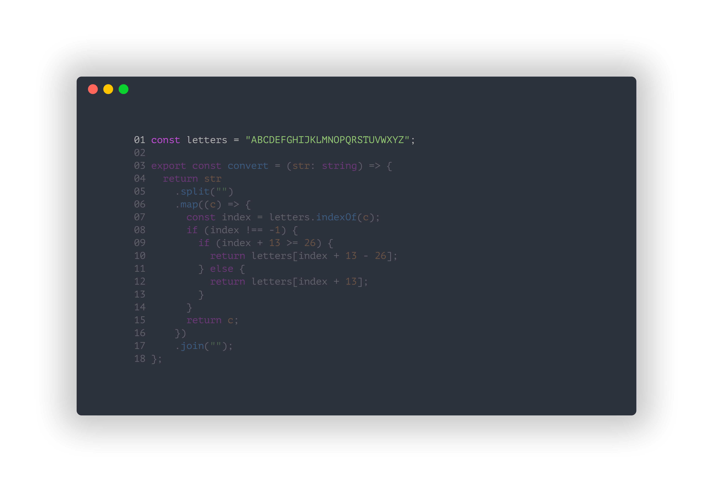

### Extract Constant

You need a variable whenever you spot an expression that is too long or needs a concept to hold. I’m not treating variables, fields and constants as different refactorings in JavaScript or TypeScript usually; the only difference would be the scope of where to put them.

For the code snippet below, the empty string can be extracted as a variable named `separator` as that is what exactly it does. Also, the constant `13` can be pulled into `shift` or `offset` to indicate its meaning (we'll do that in a minute).

Press `command + option + v` in WebStorm will do the work:

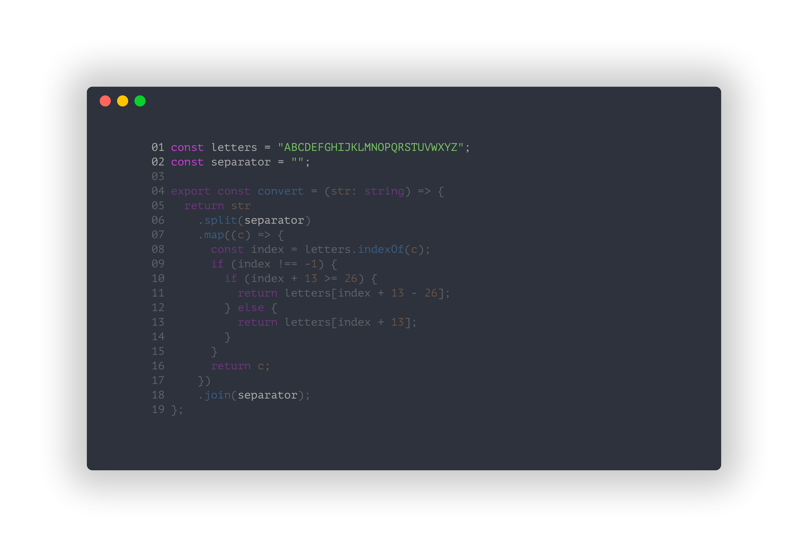

Nothing fancy at all. One important aspect of clean code is it should not raise any surprise to their reader. It should be plain and straightforward.

### Extract Function

Functions are the most crucial building block in many programming languages, and also it’s a perfect place to put your business logic and expressions in. If you don’t pay close attention, it can quickly go oversize or have too many things inside. 

Although there is no such law for how many lines of code for the function body, I tend to make it small. If it goes too long, I extract sub-function from some statements to make them readable and easy to modify. *The key here is how you would name your extracted functions*.

For example, the anonymous function inside the map can be extracted into a separate function, which will be much easier to read and test (or be reused in other places).

The shortcut for the Extract Function is `command + option + M` (M for method in Object-Orient Language)

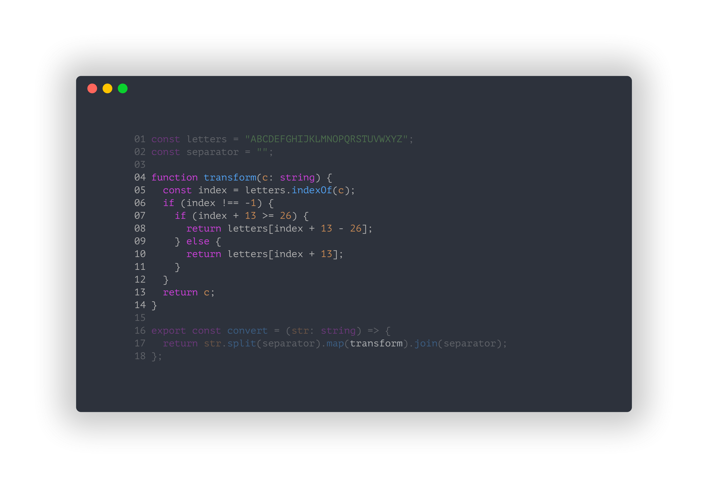

### Rename Parameter

Renaming a function's parameter is equally as important as renaming a variable inside it. A good parameter name should tell what the expected parameter is for. You may have your own convention here. For example, `aLetter` is one of the ways I saw a lot in some old codebases. I prefer a generic and short name for parameter names.

Press `command + option + p` can start the renaming process in WebStorm. A tiny popup will show up, and once you have done the editing, hit Enter to finalise it, and all the references will be updated automatically.

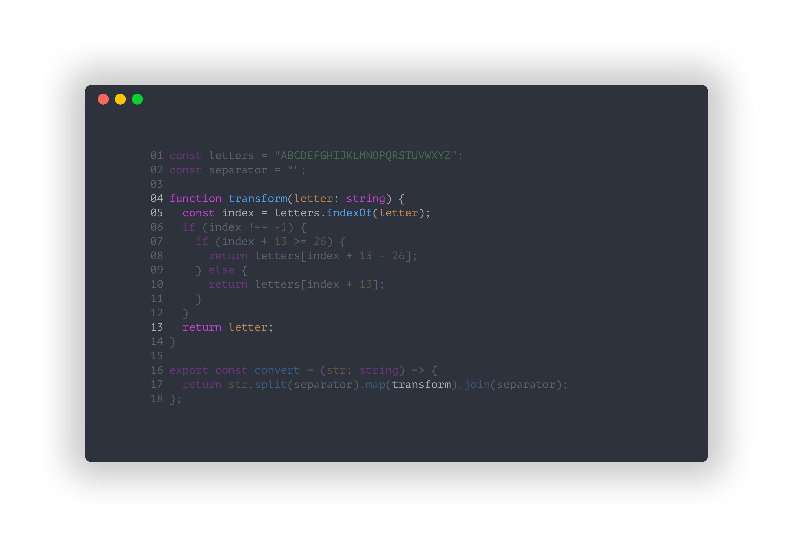


### Rename Variable

The same thing applies to variables as well. There are many times I couldn’t think of a good name, so I would use a pretty general one, like x or segment, as a placeholder, and once I made the change and got a better idea of what the variable is holding, I would change the variable name.

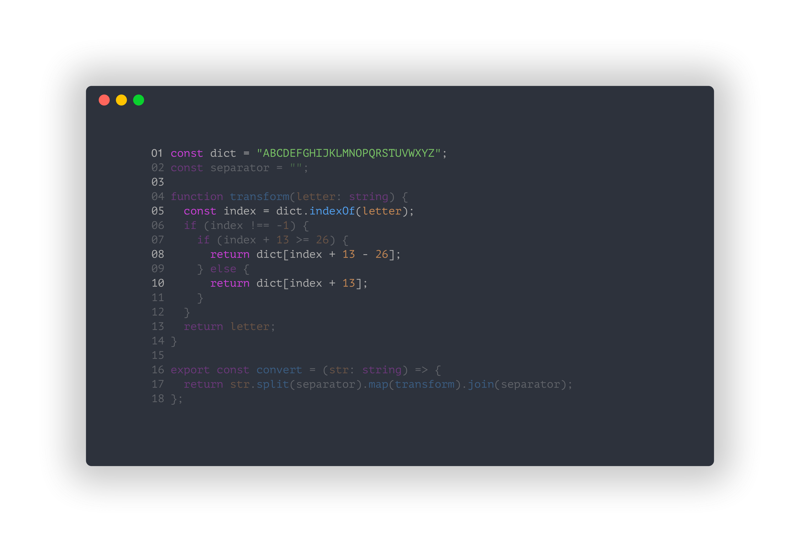

The old variable `letters` is a bit unclean, so I renamed it to `dict` by pressing `shift + F6`. It's a generic renaming shortcut that can also be used for renaming a function.

And since there are quite a few lines in the function `transform`, we can apply the Extract Function one more time.

### Extract Function

Press `command + option + m` again to extract a new function here called `getLetterWithOffset`. That way, we simplified the `transform` a bit. Note the general principle is that **the smaller a function is, the more likely it can be reused**. We're not aiming for a small function, but reusability is important.  

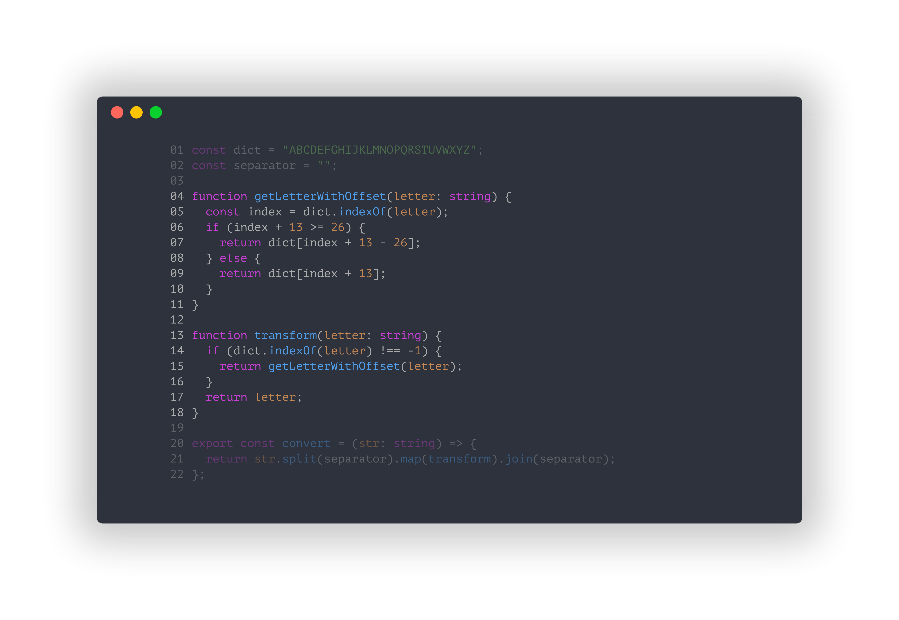

Note that function is the most important building block in most languages, so please pay more attention to the size and meaning of functions. Once you spot an oversized function, try to break it down with `Extract Function`.

### Replace `if-else` with `?`

In WebStorm, if you press `option + enter`, some context-related suggestions will pop up. For example, if an `if-else` is short and straightforward enough, I prefer to use a ternary operator to replace them.

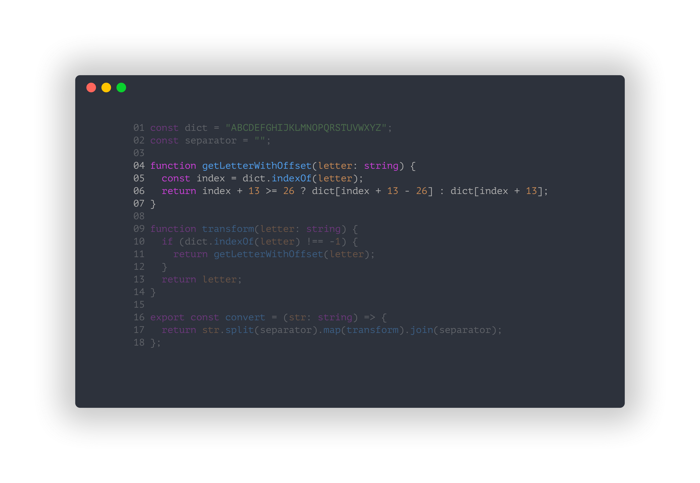

In WebStorm, `option + enter` often give you great options when you not sure what's to optimise. I also use it to fix the auto import when it complains that some constants, types or functions are not defined or to fix incompatible type issues.

### Extract Function

Let's do the `Extract Function` one more time by pressing `command + option + M` to put the index calculation out as a separate function. It seems there is some pattern about to emerge once we have the `getIndex`, isn't it?

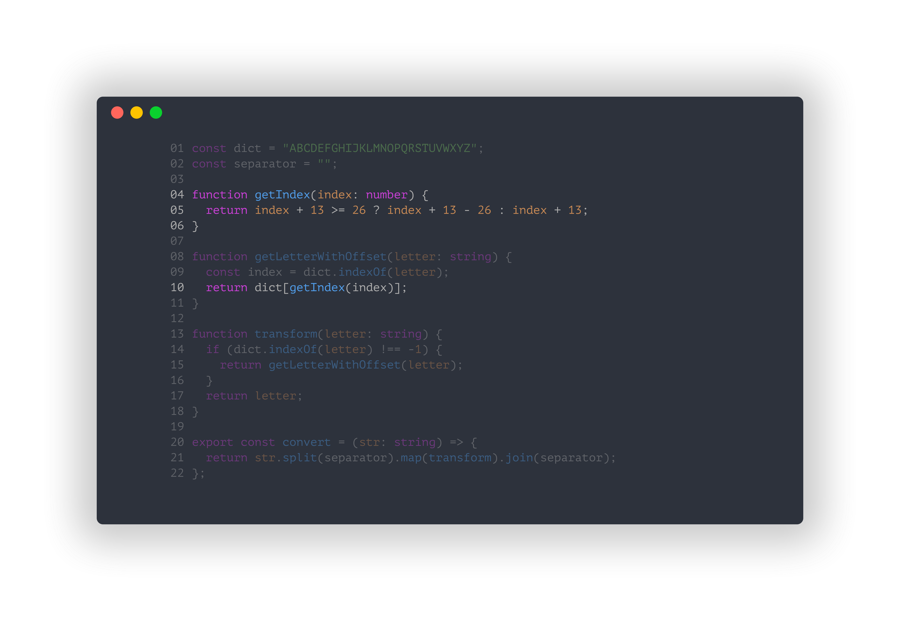

Even in some cases, it may seem unnecessary to create a new function, but it is worth doing it as, in many cases, once you extract a new one, some duplications would appear like magic. And the worst case is that you can always inline the extracted logic back by pressing `command + option + n` in WebStorm.

### Extract Parameter

Extract Parameter often happens during a big refactoring inside a function. When you need an internal state to be passed in from the outside world, and you don’t want to use a global constant at that point, you can extract a parameter first and then in the calling place, pass in a variable (could be a global constant).

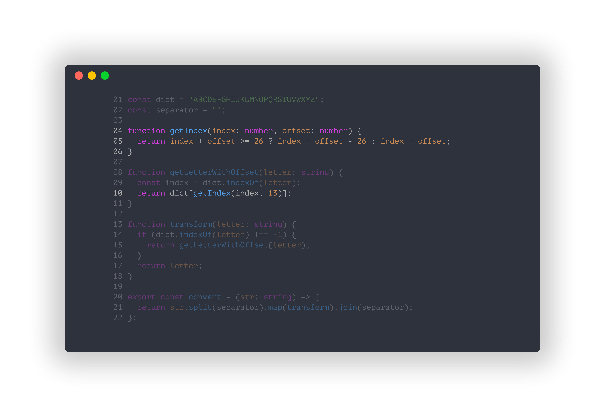

Here we extract an optional parameter with `command + option + P` first with a default value, so it will not break any existing code. Then we can check all the call sites and fix them.

### Extract Constant

It seems the `13` here is not really meaningful, so let's `command + option + c` to give it a better name. Note you can use a family of shortcuts to extract constant `command + option + C`, extract variable `command + option + v`, extract parameter `command + option + p` and extract method (function) `command + option + m`.

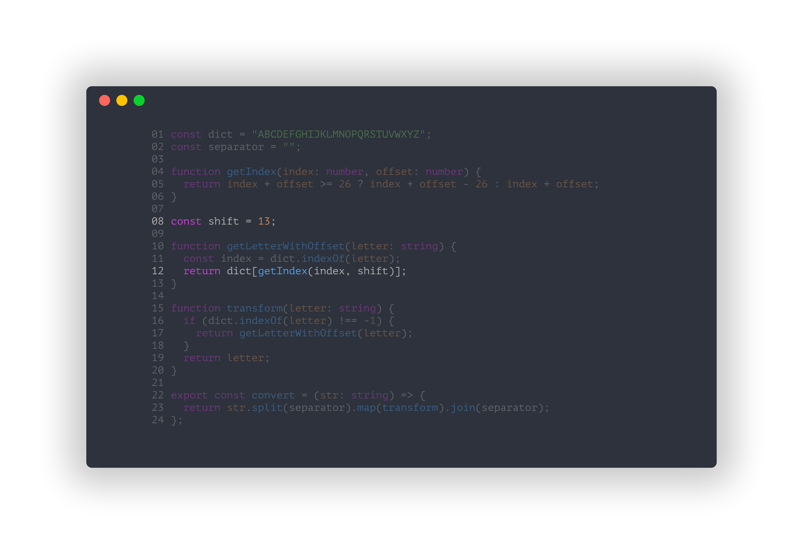

### Slide Statements

We then would slide this constant up to the variable definition area for the next move.

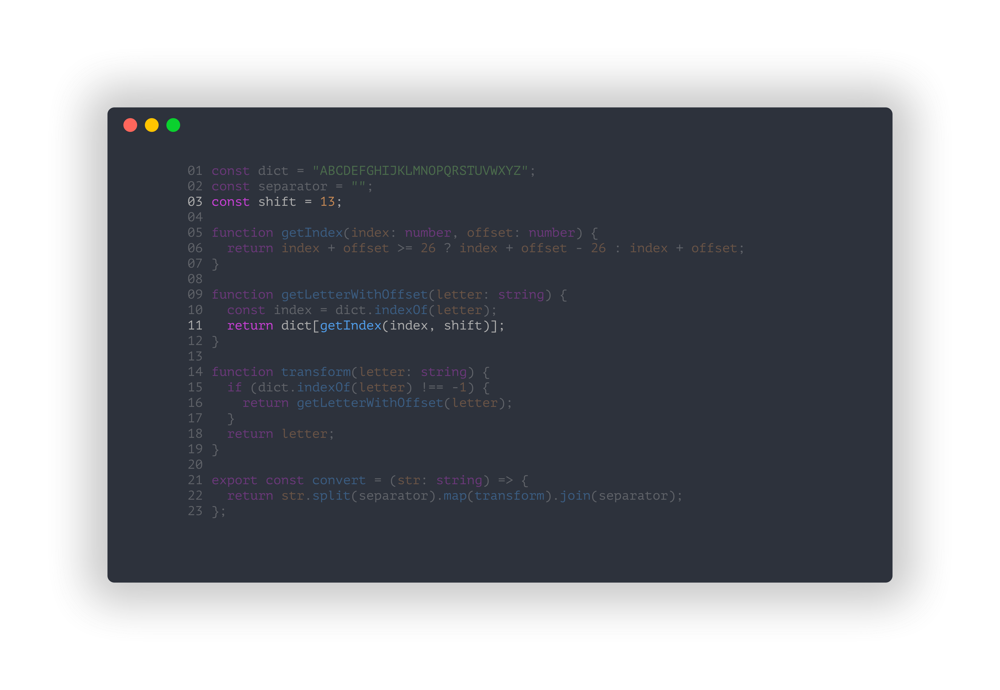

As we mentioned earlier, you not only can slide one statement but also a couple of statements, a block or a function. Select the block, and `command + shift + up/down`.

### Move Fields

Often when you slide statements up to the higher scope or extract a few utility functions, you will soon realise it may be good to move them into a place so other modules can use too. Also, I found even if it’s not that commonly reusable, moving them to a separate file can make the current file concise, thus easier to read and understand.

Press `F6` will launch a popup for you, then select variables, and functions that you would like to move out, type in a file name, and you're done. If the file doesn't exist, WebStorm will create one for you. Otherwise, the content will be amended.

Let's say we would like to move. 

```ts
export const dict = "ABCDEFGHIJKLMNOPQRSTUVWXYZ";
export const separator = "";
export const shift = 13;
```

Into file `constants.ts`, and then in file `convert.ts` we reference these constants:

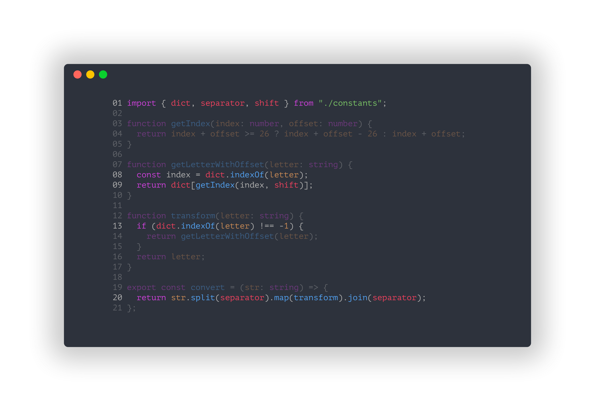

### Function to Arrow function

The arrow function should be your default choice now. It's more compact and clear once you get used to it. I only use a traditional function declaration in very few cases, like a React function name that displayName matters.

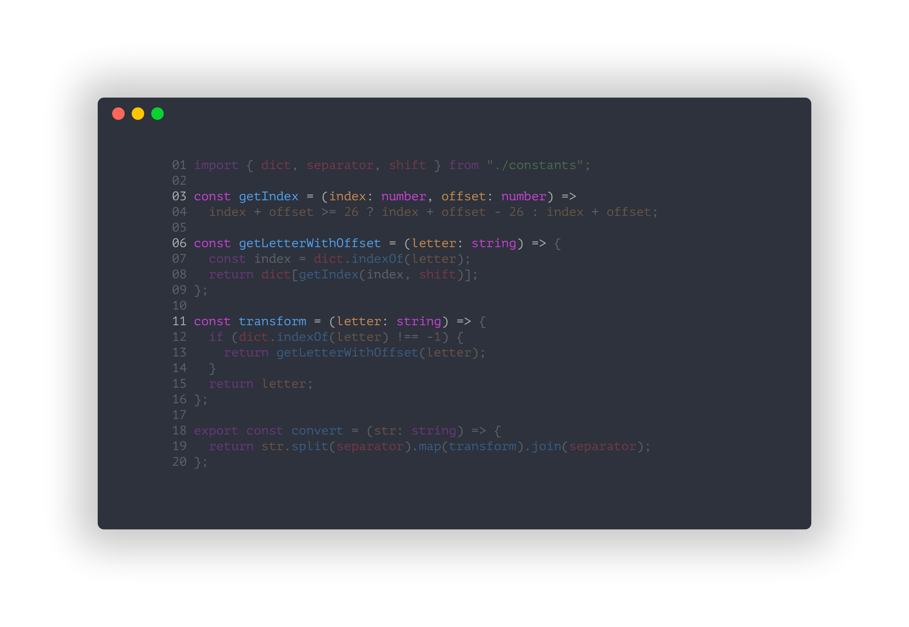

This can be done by `option + enter`. WebStorm will show you a couple of great suggestions. And in this case, **convert to variable holding arrow function** would do the work.

### Simplify Logic

Finally, let's make some final touches to make the code looks even more professional.

For example
- Can use `dict.includes` to replace `dict.indexOf`
- Use `dict.length` to replace hardcode 26
- Use mod operation `%` to get a new index when it is out of `dict` bound

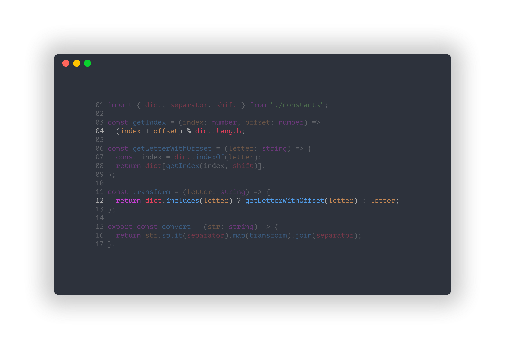

And when we run all the tests again, it should not surprise us at all.

### Rename Variable

One more thing, if I may, is to rename `shift` to `offset` as I feel it sounds more natural in the context. You can do this by `Shift + F6` when the caret is on `shift`, which will automatically update the constants defined in another file.

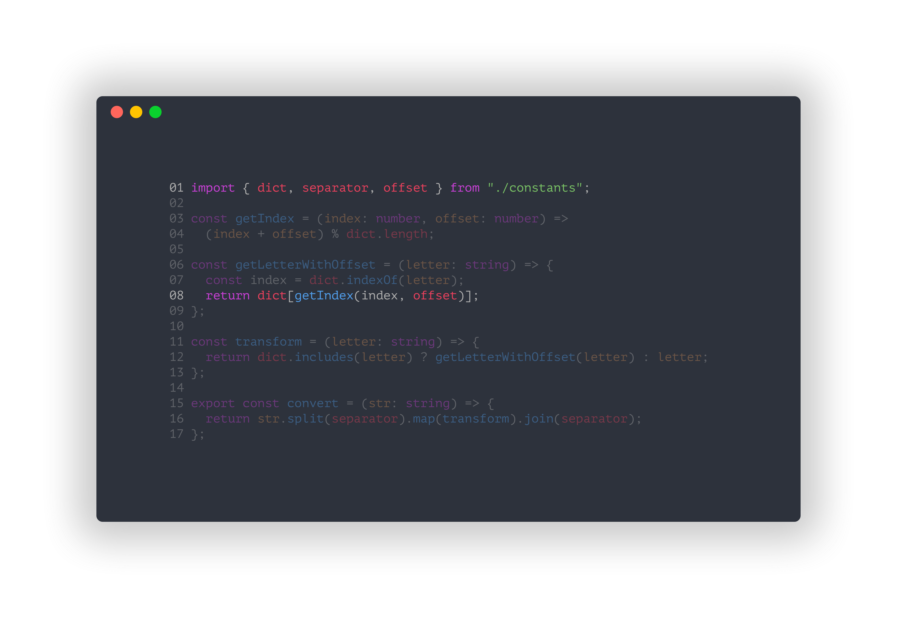

## Summary

In this step-by-step tutorial, I've walked you through a series of refactorings that make the code a bit easier to understand and more straightforward to modify. The main focus here is using keyboard shortcuts (WebStorm) to accelerate your speed of making simple but common refactorings. And once you make them as muscle memory without thinking, you'll be much more efficient and productive in coding and refactoring.
